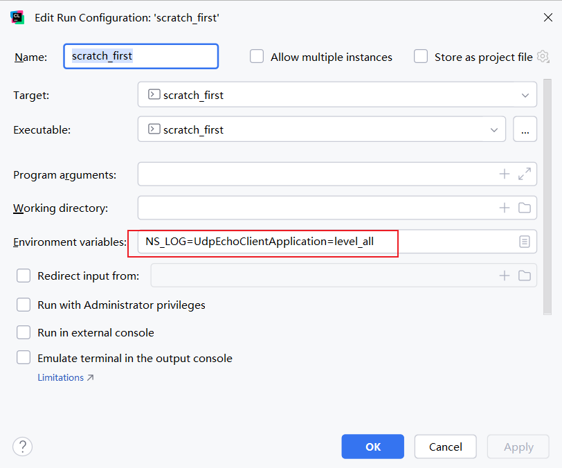

# ns-3 Tutorial Walkthrough

### Preface

The walkthrough is based on [ns-3 v3.42 official tutorial](https://www.nsnam.org/docs/release/3.42/tutorial/html/index.html)

Instead of explaining all things, I will only explain something noticeable. You should combine this walkthrough with the official tutorial.

I will use `CLion 2024.1.4` as the IDE.

Section titles below correspond to those in the official tutorial.

### 5.1.1 Node

* The `Node` class can be found in `src/network/model/node.h` and `src/network/model/node.cc`

### 5.1.2 Application

* The `Application` class can be found in `src/network/model/application.h` and `src/network/model/application.cc`

### 5.1.4 Net Device

* The `NetDevice` class can be found in `src/network/model/net-device.h` and `src/network/model/net-device.cc`

### Precautions When Using CLion

You should click `File->Settings...->Build, Execution, Deployment->CMake` to configure the ns-3 project and enable examples before moving on to subsequent sections.


### Examples' Location

* `examples/tutorial`

### 5.2.2 Module Includes

The granularity of the header files used is relatively large, and they are not the exact header files that need to be used, but rather header files that contain a batch of header files.

The naming of this file implies certain rules, such as `core-module` , which corresponds to the `src/core` directory (module), as well as `applications-module` , which corresponds to the `src/applications` directory (module).


The `build/optimized` directory mentioned in the tutorial requires the corresponding configuration to be enabled.


### 5.2.4 Logging

> In the list of Macros’s at the top of the page you will see the entry for NS_LOG_COMPONENT_DEFINE. Before jumping in, it would probably be good to look for the “Detailed Description” of the logging module to get a feel for the overall operation.

is on the basis of this page: 

> but you can find out about the above statement by looking at the Core module, then expanding the Debugging tools book, and then selecting the Logging page. Click on Logging.

Or you can find the corresponding page by searching for this macro in the search bar.

The specific location is:


When you look at the “Detailed Description” of the logging module in the Doxygen documentation, you will notice something about environment variables. For more details about environment variables, you may look at the [ns-3: Environment Variables (nsnam.org)](https://www.nsnam.org/docs/release/3.42/doxygen/d7/d86/group__core-environ.html).

Originally, `NS_LOG` was a CMake cache variable set through the CMake options, with only two values: ON and OFF. However, if an environment variable is specified, the cache variable will be ignored.

When you look at the `NS_LOG_COMPONENT_DEFINE` macro in the Doxygen documentation, you may notice the sentence:

> This macro should be placed within namespace ns3.

I don't understand why either. The official examples themselves also do not include this macro definition in the ns3 namespace.


### 5.2.7.1 UdpEchoServerHelper

> Similar to many other helper objects, the UdpEchoServerHelper object has an Install method. It is the execution of this method that actually causes the underlying echo server application to be instantiated and attached to a node. Interestingly, the Install method takes a NodeContainer as a parameter just as the other Install methods we have seen. This is actually what is passed to the method even though it doesn’t look so in this case. There is a C++ implicit conversion at work here that takes the result of nodes.Get(1) (which returns a smart pointer to a node object — Ptr<Node>) and uses that in a constructor for an unnamed NodeContainer that is then passed to Install. If you are ever at a loss to find a particular method signature in C++ code that compiles and runs just fine, look for these kinds of implicit conversions.

Here the author talks much about `implicit conversion` . However, even though I know the `C++ implicit conversion` , I still do not know what is this meaning.

> one in this case since we passed a NodeContainer containing one node

Cannot understand why the `NodeContainer` here only contain one node rather than two nodes, besides what the program passes to the `Install` method is a `Ptr<Node>` .

### 5.2.7.2 UdpEchoClientHelper

```c++
echoClient.SetAttribute("PacketSize", UintegerValue(1024));
```

Here, the `PacketSize` should only include the size of the payload, without the Point-to-Point protocol header.

### 5.2.9 Building Your Script

Using `CLion` , it seems that the program can be run directly in the original `first.cc` file's directory. Of course, by moving the file to the scratch directory, it can also be run after being built.

If you want to see output from the console, you can use the `DEBUG` profile to see it, but not the `RELEASE` profile.


### 6.1.1 Logging Overview

> Logging should be preferred for debugging information, warnings, error messages, or any time you want to easily get a quick message out of your scripts or models.

The above sentence indicates the applicable scenarios of the `Logging Module` .

> For each LOG_TYPE there is also

Here, `LOG_TYPE` refers to the seven levels of log messages, e.g., `LOG_ERROR` .

### 6.1.2 Enabling Logging

Any changes in the `scratch` directory will be ignored by `Git` .

We set the logging level via the `NS_LOG` environment variable in Windows CMD using the `set` command.


Notice, there is no space character after `level_all` .

Notice that you need to run the `.exe` file with `debug` in its filename if you are using Windows CMD.


Or you can do it in `CLion` in this way:



> You can resolve this by OR’ing the prefix_func level into the NS_LOG environment variable.

In Windows CMD, you need to do the following:


Because `|` is a pipeline symbol in Windows CMD.

> You can also see that the echo client application is started at a simulation time of two seconds as we requested in the script.

corresponds to the code below:


`ScheduleTransmit` method can be seen in `src/applications/model/udp-echo-client.h` and `src/applications/model/udp-echo-client.cc`

`HandleRead` method can be seen in `src/applications/model/udp-echo-server.h` and `src/applications/model/udp-echo-server.cc`

> Note that the elapsed time for the packet to be sent across the point-to-point link is 3.69 milliseconds.

The value `3.69` can be obtained by simply subtracting `2.000000000` from `2.003686400` :

```
+2.000000000s UdpEchoClientApplication:Send(): At time +2s client sent 1024 bytes to 10.1.1.2 port 9
+2.003686400s UdpEchoServerApplication:HandleRead(0x8edfc0, 0x936770)
```

### Roughly Calculate the Time in the Log

Taking `first.cc` as example, the output is:

```
At time +2s client sent 1024 bytes to 10.1.1.2 port 9
At time +2.00369s server received 1024 bytes from 10.1.1.1 port 49153
At time +2.00369s server sent 1024 bytes to 10.1.1.1 port 49153
At time +2.00737s client received 1024 bytes from 10.1.1.2 port 9
```

The configuration in the code is:


In the first line, the client sent 1024 bytes at time +2s.

After adding an 8-byte UDP header, a 20-byte IP header, and an 8-byte PPP protocol overhead to the data section, a total of 1060 bytes was finally sent.

$\frac{1060 \times 8}{5 \times 10^6} = 0.001696s$

`0.001696` seconds plus link delay of `0.002` seconds equals `0.003696` seconds.

Because the client sent data at time +2s, the server is supposed to receive the data at time +2.003696s.

The second line shows that the server receive data at time +2.00369s. This means that our calculations are essentially error-free.

### 6.2.1 Overriding Default Attributes

When using Windows CMD, if you want to pass the command line argument to the script, you should:


When using `CLion` , if you want to pass the command line argument to the script, you should:


1 Mbps = $10^{6}$ bps

> Another way to find out about attributes is through the ns-3 Doxygen; there is a page that lists out all of the registered attributes in the simulator.

Here we take `PointToPointChannel` as example, the attributes of `PointToPointChannel` can be seen as follows:


### 6.3.1 ASCII Tracing

> Right before the call to Simulator::Run(), add the following lines of code:

Note, it is before.

> You are telling ns-3 to deal with the lifetime issues of the created object and also to deal with problems caused by a little-known (intentional) limitation of C++ ofstream objects relating to copy constructors.

Here, it refers to copy constructor is marked as delete.

> thus we need to change into the top level directory of our repo and take a look at the ASCII trace file myfirst.tr in your favorite editor.

When you are using `CLion` , you do not need to hange into the top level directory of your repo, as `CLion` will generate `myfirst.tr` as follows:


### 6.3.2.1 Reading output with tcpdump

To use tcpdump here, I accessed files mounted on the file system using the Windows Subsystem for Linux (WSL), as it is not easy to use tcpdump directly on Windows.

### 6.3.2.2 Reading output with Wireshark

If you use `Wireshark` to open the `.pcap` file, you will see:


### 7.1 Building a Bus Network Topology

> Just as in the first.cc example (and in all ns-3 examples) the file begins with an emacs mode line and some GPL boilerplate.

Now we cannot see the emacs mode lines.

> Notice that you can set an Attribute using its native data type.

This sentence may mean that no additional unit conversion is required.

```cpp
csma.SetChannelAttribute("Delay", TimeValue(NanoSeconds(6560)));
```

Take above code as example, the unit of `6560` is nano second, it is unnecessary for us to replace `6560` to $6.56 \times 10^{-6}s$ .

PPP network and CSMA network are different subnets.

```cpp
UdpEchoClientHelper echoClient(csmaInterfaces.GetAddress(nCsma), 9);
```

The parameters of `UdpEchoClientHelper` 's constructor refer to server's IP and port.

> what happens is that each node behaves as if it were an OSPF router that communicates instantly and magically with all other routers behind the scenes. Each node generates link advertisements and communicates them directly to a global route manager which uses this global information to construct the routing tables for each node.

Different from the traditional OSPF working mode, the traditional flooding method sends information to all routers.

If you are using `CLion` , You have encountered such an error: 


You could reload the top-level `CMakeLists.txt` .


### 7.2 Models, Attributes and Reality

This section mainly discusses the differences and connections between simulation and reality.

### 7.3 Building a Wireless Network Topology

STA node refers to a node that uses the 802.11 protocol, excluding APs.

SSID can be simply understood as a Wi-Fi network name.

> WifiHelper will, by default, configure the standard in use to be 802.11ax (known commercially as Wi-Fi 6) and configure a compatible rate control algorithm (IdealWifiManager).

`IdealWifiManager` can be seen in `src/wifi/model/rate-control/ideal-wifi-manager.h` and `src/wifi/model/rate-control/ideal-wifi-manager.cc` .

802.11ax is newer than 802.11n.

Beacon frames, sent by the AP, are used to inform the outside world of the existence of the wireless network.

```cpp
mac.SetType("ns3::ApWifiMac",
            "Ssid", SsidValue(ssid));
```

In the above code, `mac` is a helper, `ns3::ApWifiMac` is the MAC layer.

```cpp
InternetStackHelper stack;
stack.Install(csmaNodes);
stack.Install(wifiApNode);
stack.Install(wifiStaNodes);
```

Note that the `wifiApNode` and `csmaNodes` contain `p2pNodes`.

```
$ ./ns3 run 'scratch/mythird --tracing=1'
```

Here `--tracing=true` is ok too.

> You can see that the link type is now 802.11 as you would expect. You can probably understand what is going on and find the IP echo request and response packets in this trace. We leave it as an exercise to completely parse the trace dump.

The exercise's answer is as follows:


The trace output may have some differences in terms of time.

```
/NodeList/7/$ns3::MobilityModel/CourseChange
```

The `7` here are in a certain order, perhaps reflecting the time sequence in which the `NodeContainer` created the `Node` .

Here are some attributes of `GridPositionAllocator` :


You can also find these in the Doxygen documentation.

Here is an attribute of `RandomWalk2dMobilityModel` :


You can also find it in the Doxygen documentation too.

### 8.2.1.1 Callbacks

for

```cpp
int (*pfi)(int arg) = 0;
```

It can also be written as:

```cpp
int (*pfi)(int) = 0;
```

In C++, you can use function name as the address of function.

### 8.2.1.2 Walkthrough: fourth.cc

`ns3::TracedValueCallback::Int32` can be found in `src/core/model/traced-value.h` .

For trace sink function `traceSink` , its signature is the same as the `typedef` `ns3::TracedValueCallback::Int32` .

> that looks just like the pfi() example above to be called by the trace source.

`pfi()` here has already been discussed in in `8.2.1.1 Callbacks` .

> The declaration of the TracedValue<int32_t> m_myInt; in the Object itself performs the magic needed to provide the overloaded assignment operators that will use the operator() to actually invoke the Callback with the desired parameters. 

Here the overloaded assignment operators of `TracedValue` will call `void Set(const T& v)` , in which will use the operator() to actually invoke the Callback with the desired parameters.


```cpp
myObject->m_myInt = 1234;
```

Code above will call `TracedValue(const T& v)` at first, then will call `operator=` .

### 8.2.2 Connect with Config

```cpp
theObject->GetObject<MobilityModel>()->TraceConnectWithoutContext("CourseChange", MakeCallback(&CourseChange));
```

The code above is missing one parameter, the right code should be:

```cpp
theObject->GetObject<MobilityModel>()->TraceConnectWithoutContext("CourseChange", oss.str(), MakeCallback(&CourseChange));
```

`oss.str()` is a context.

`Node` a subclass of an `ns3::Object` .

```cpp
void
MobilityModel::NotifyCourseChange() const
{
  m_courseChangeTrace(this);
}
```

`m_courseChangeTrace(this)` is calling `operator()` method rather than a constructor.

### 8.2.5 Config Paths

> Let’s assume that you have just found the “CourseChange” trace source in the “All TraceSources” list 

You can find the `CourseChange` trace source in the `ns3::MobilityModel` part in the Doxygen documentation.


> another way to find the Config path is to grep around in the ns-3 codebase for someone who has already figured it out

The sentence above tells us to search for an existing solution in the code repository.

### 8.2.6 Callback Signatures

```cpp
typedef void (* CourseChangeCallback)(std::string context, Ptr<const MobilityModel> * model)
```

In the tutorial, the callback signature is given as above.

However, when I reviewed the Doxygen documentation, I found that neither `MobilityModel` nor `RandomWalk2dMobilityModel` had the same callback signature as described in the tutorial.


### 8.2.6.1 Implementation

```cpp
template<typename T1 = empty, typename T2 = empty,
         typename T3 = empty, typename T4 = empty,
         typename T5 = empty, typename T6 = empty,
         typename T7 = empty, typename T8 = empty>
class TracedCallback
{
}
```

`TracedCallback` is a templated class, however it looks like this:

```cpp
template <typename... Ts>
class TracedCallback {}
```

It is a variadic templates.

> you will be able to find that the file ./core/callback.h is the one we need to look at.

You will be able to find that the file **./core/model/callback.h** is the one we need to look at.

> which is exactly what we used in the third.cc example.

Actually, the `CourseChange` method in `third.cc` does not have a `static` keyword.

### 8.3.2 Finding Examples

`src/test/ns3tcp/ns3tcp-cwnd-test-suite.cc` does not exist in the current version.

### 8.3.4.2 The TutorialApp Application

The socket using here is implemented by ns-3.

```cpp
if (m_socket)
{
  m_socket->Close();
}
```

Here m_socket is a `Ptr` object. The `Ptr` class implement `operator bool()` method and contextual conversion is performed.

See [Contextual conversions](https://en.cppreference.com/w/cpp/language/implicit_conversion#Contextual_conversions) for details.

### 8.3.6.1 Walkthrough: sixth.cc

> It turns out that this is a very simple object, but one that manages lifetime issues for the stream and solves a problem that even experienced C++ users run into. It turns out that the copy constructor for std::ostream is marked private.

The copy constructor for `std::ostream` is marked `protected` in the C++ version currently used in ns-3.

```cpp
Ptr<PcapFileWrapper> file = pcapHelper.CreateFile("sixth.pcap",
"w", PcapHelper::DLT_PPP);
```

The `CreateFile` method 's signature has changed to:

```cpp
Ptr<PcapFileWrapper> CreateFile(std::string filename,
                                    std::ios::openmode filemode,
                                    DataLinkType dataLinkType,
                                    uint32_t snapLen = std::numeric_limits<uint32_t>::max(),
                                    int32_t tzCorrection = 0);
```

> These are the same as the PCAP library data link types defined in bpf.h

Unable to find in `bpf.h` document, but found in other files in the library `the-tcpdump-group/libpcap` .

### 8.4.1.1 PCAP

> All of the public methods inherited from class PcapUserHelperForDevice reduce

Here the class name is `PcapHelperForDevice` rather than `PcapUserHelperForDevice` .

### 8.4.1.1.1 Methods

> You can enable PCAP tracing on the basis of Node ID and device ID as well as with explicit Ptr.

This sentence should be understood with the method signature:

```cpp
void EnablePcap(std::string prefix, Ptr<NetDevice> nd, bool promiscuous = false, bool explicitFilename = false);
```

You can see a `Ptr` object.

### 8.4.1.1.2 Filenames

> By default, then, a PCAP trace file created as a result of enabling tracing on the first device of Node 21 using the prefix “prefix” would be prefix-21-1.pcap.

The first device should be 0, shouldn't it?

### 8.4.1.2.1 Methods

> Note that since the user is completely specifying the file name, the string should include the ,tr suffix for consistency.

should change to:

> Note that since the user is completely specifying the file name, the string should include the .tr suffix for consistency.

### 8.4.2.1 PCAP

> Take a look at src/network/helper/trace-helper.h if you want to follow the discussion while looking at real code.

should be:

> Take a look at src/internet/helper/internet-trace-helper.h if you want to follow the discussion while looking at real code.

> You can enable PCAP tracing on a particular node/net-device pair by providing a std::string representing an object name service string to an EnablePcap method.

should be:

> You can enable PCAP tracing on a particular protocol/interface pair by providing a std::string representing an object name service string to an EnablePcap method.

### 8.4.2.2 ASCII

> What this means to the user is that all device helpers in the system will have all of the ASCII trace methods available;

should be:

> What this means to the user is that all protocol helpers in the system will have all of the ASCII trace methods available;

### 8.4.2.2.1 Methods

> You are encouraged to peruse the API Documentation for class PcapAndAsciiHelperForIpv4 to find the details of these methods;

The `PcapAndAsciiHelperForIpv4` does not even exist.

> Note that since the user is completely specifying the file name, the string should include the “,tr” for consistency.

`,tr` should change to `.tr` .

### 9.2 Example Code

```
seventh-packet-byte-count-0.txt
seventh-packet-byte-count-1.txt
seventh-packet-byte-count.dat
seventh-packet-byte-count.plt
seventh-packet-byte-count.png
seventh-packet-byte-count.sh
```

The `seventh-packet-byte-count.png` does not exist at first, you need to run the `seventh-packet-byte-count.sh` first.

### 9.3 GnuplotHelper

> When we examine this class implementation (src/internet/model/ipv6-l3-protocol.cc) we can observe

l(letter)3 not 1(digit)3.

```cpp
.AddTraceSource("Tx", "Send IPv6 packet to outgoing interface.",
                MakeTraceSourceAccessor(&Ipv6L3Protocol::m_txTrace))
```

The above code is missing a parameter. It should be:

```cpp
.AddTraceSource("Tx", "Send IPv6 packet to outgoing interface.",
                  MakeTraceSourceAccessor(&Ipv6L3Protocol::m_txTrace),
                  "ns3::Ipv6L3Protocol::TxRxTracedCallback")
```


